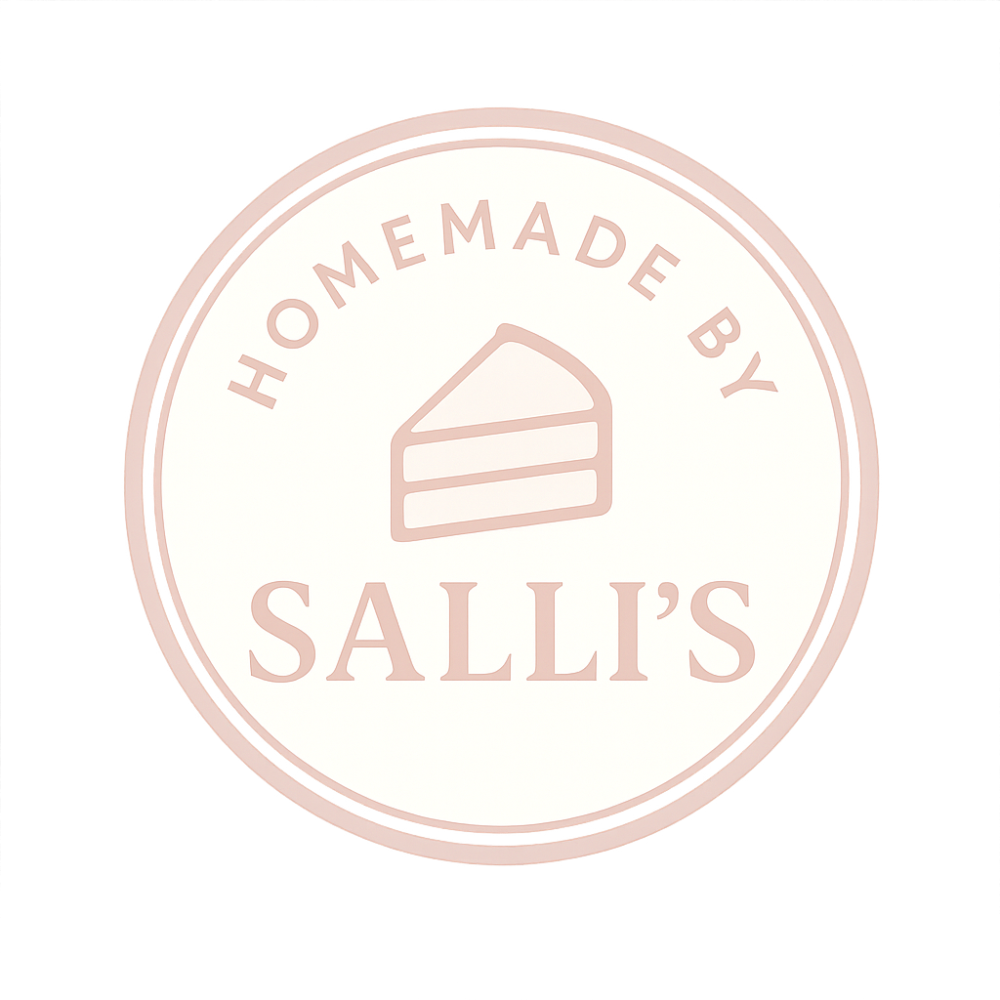
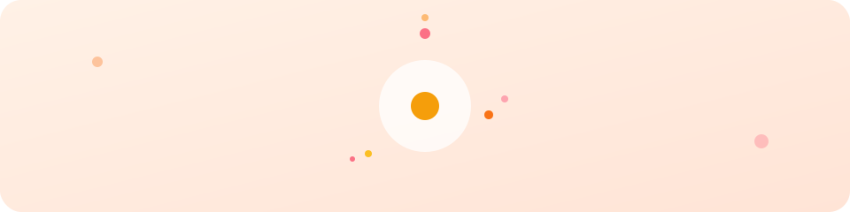
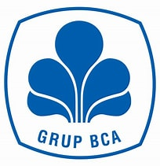
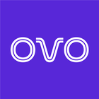
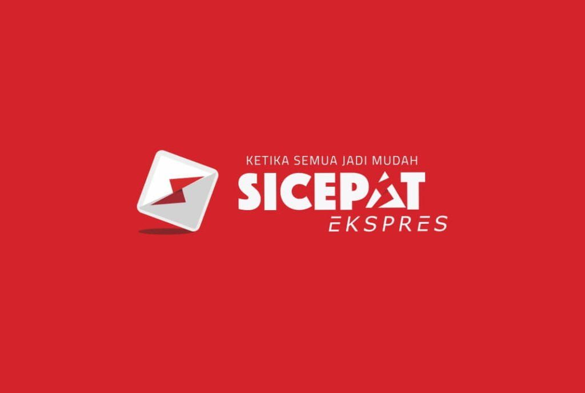
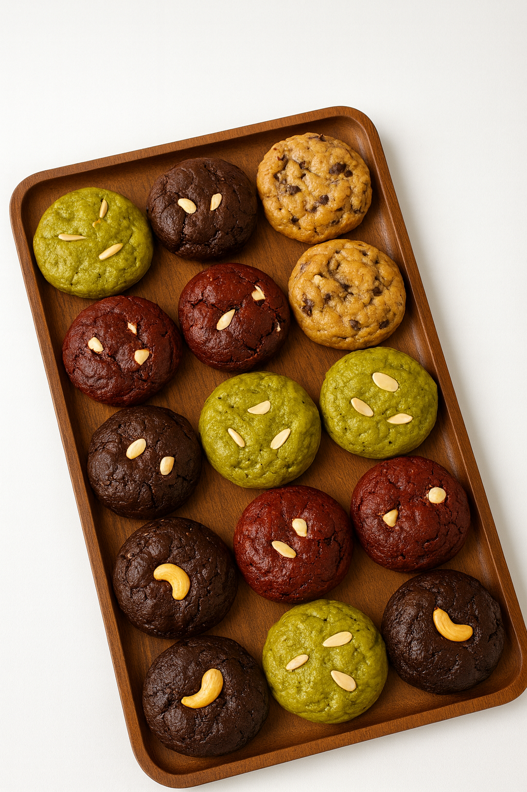
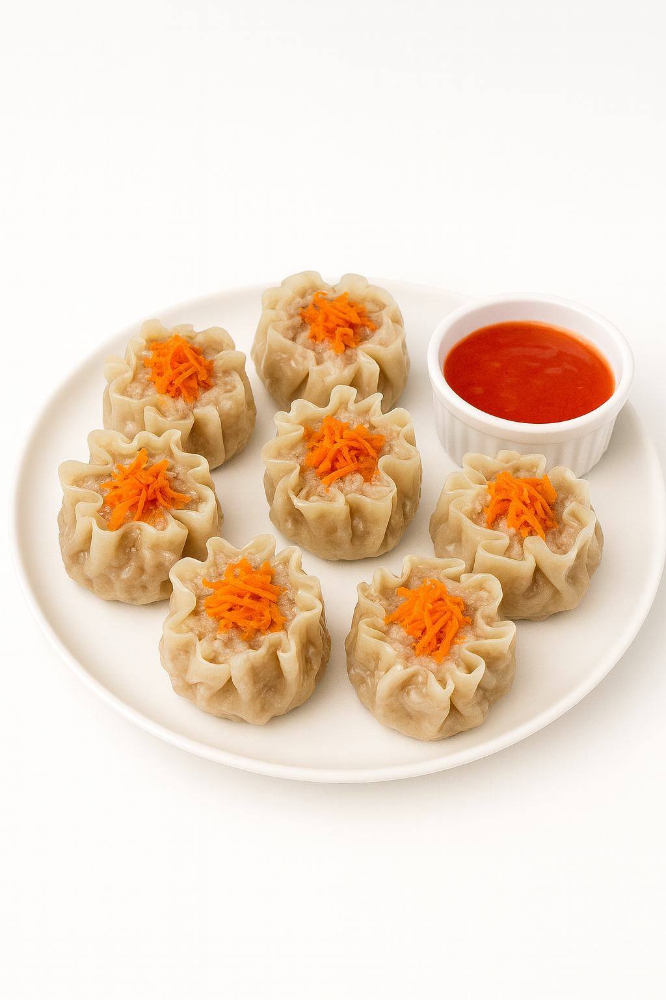
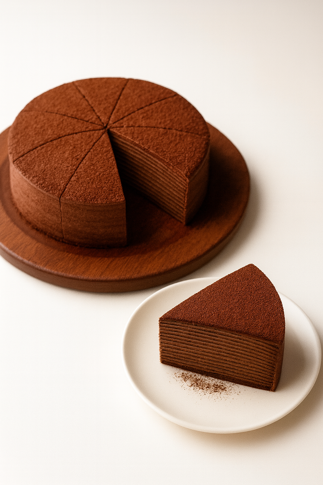

<div align="center">
  
  <h1>Salis Shop</h1>
  <p>E-commerce kue & pastry (Vite + React + TypeScript + Tailwind + Framer Motion + Zustand).</p>
  <p>
    
  </p>
  <p>
    <a href="#demo-tampilan">Demo Tampilan</a> | <a href="#fitur-utama">Fitur Utama</a> | <a href="#ikon">Ikon</a> | <a href="#animasi">Animasi</a> | <a href="#jalankan">Jalankan</a>
  </p>
</div>

## Fitur Utama
- Katalog produk kue dan pastry dengan filter dan pencarian.
- Keranjang, checkout, dan simulasi pembayaran.
- Animasi halaman, card, dan CTA dengan Framer Motion.
- Data produk terpusat di `src/data/products.ts`.
- Tema warna, animasi, dan harga dapat diubah di `src/lib/colors.ts`, `src/lib/animations.ts`, dan `src/lib/pricing.ts`.

## Tech Stack
<p align="center">
  
  
  
  
  
</p>
<p align="center">
  
  
  
  
  
</p>
<p align="center">
  
  
  
  
  
</p>
<p align="center">
  
  
</p>
<p align="center">
  Utilities: dayjs, nanoid, clsx, tinycolor2, qrcode.react, @hookform/resolvers.
</p>

## Ikon
### Pembayaran
<p align="center">
  
  
  
  
  
  
  
  
  
  
</p>

### Pengiriman
<p align="center">
  
  
  
  
  
</p>

## Galeri Produk
<p align="center">
  
  
  
  
  
  
  
  
  
</p>

- Kartu produk: staggered reveal dan hover lift.
- CTA dan badge: pulse dan shimmer.
- Transisi halaman: fade + slide.
- Loader: bounce dots dan wave bars.
- Demo UI: shimmer highlight.

## Jalankan
```bash
npm i
npm run dev
```

## Build
```bash
npm run build
npm run preview
```

Jika ingin mengganti port Ollama (PowerShell):
```powershell
$env:OLLAMA_HOST = "127.0.0.1:11435"
```

## Aset
- Logo di `public/assets/logo-salis.png`.
- Aset gambar produk di `public/assets/products/*`.
- Ikon pembayaran di `public/assets/payments/*` dan pengiriman di `public/assets/delivery/*`.
- Animasi README di `public/assets/readme/*`.

## Cara simulasi pembayaran
1. Tambahkan produk ke keranjang dan lanjutkan hingga halaman Checkout.
2. Isi data pengiriman lalu simpan untuk berpindah ke halaman Payment.
3. Pilih salah satu metode demo (VA bank, e-wallet, QRIS, atau COD) kemudian tekan "Lanjutkan ke gateway demo".
4. Pada halaman Gateway tekan tombol "Simulasikan berhasil" atau tunggu deteksi otomatis untuk QRIS.
5. Halaman Success akan tampil dengan struk. Gunakan tombol "Unduh struk" bila perlu.
